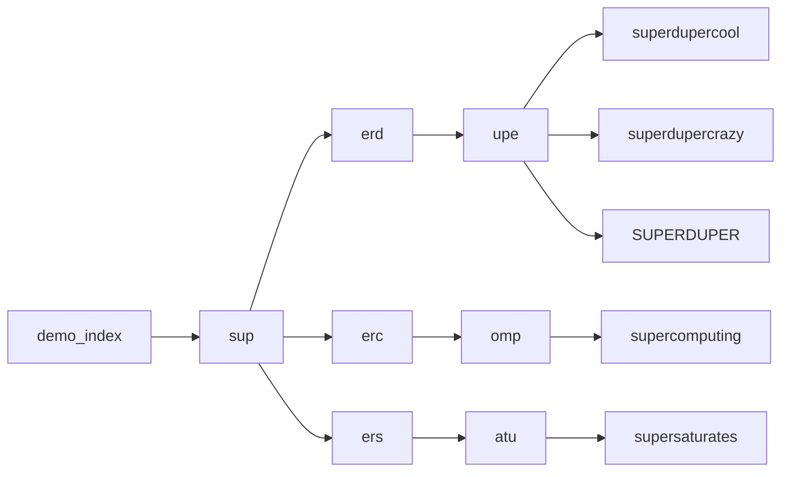

# Prefix Index

A library crate to implement a prefix index in your holochain zomes.

A prefix index is useful for typeahead "search" functionality.

## Usage

1. Include the hc_prefix_index crate in your coordinator zome's Cargo.toml:

```toml
[dependencies]
...
hc_prefix_index = "=0.9.0"
```

2. Include the hc_prefix_index crate in your integrity zome's Cargo.toml

3. Create a link type for the index:
```rust
#[hdk_link_types]
enum LinkTypes {
    PrefixIndex
}
```

4. Add the prefix index validation functions to your validate match arm for CreateLink and DeleteLink on LinkTypes::PrefixIndex

5. Setup a prefix index

```rust
use prefix_index::PrefixIndex;

let index = PrefixIndex::new("demo_index".into(), LinkTypes::PrefixIndex, 3, 3)?;
```

6. Add some results to the index:
```rust
index.add_result("superdupercool");
index.add_result("superdupercrazy");
index.add_result("supercomputing");
index.add_result("supersaturates");
index.add_result("SUPERDUPER");

```

7. This will generate an index of links for the strings as follows:



8. Now you can search the index using DFS.
```rust
index.get_results("sup", 10);
// [
//   "supercomputing",
//   "SUPERDUPER",
//   "superdupercool",
//   "superdupercrazy",
//   "supersaturates",
// ]

let res2 = index.get_results("superduper", 10);
// [
//   "SUPERDUPER",
//   "superdupercool",
//   "superdupercrazy",
//   "supercomputing",
//   "supersaturates",
// ]

let res2 = index.get_results("superduper", 2);
// [
//   "SUPERDUPER",
//   "superdupercool",
//   "superdupercrazy",
// ]

let res2 = index.get_results("walrus", 10);
// [ ]
```

## Gotchas

All strings beneath the top-level prefix of your search query will be returned (ordered by similarity, then alphabetically), so make sure to specify a "limit" to reduce the number of returned results.

Letter casing is *ignored* in the index, but is *preserved* in the results.

## Todo
- [ ] Cursor-based pagination (i.e. give me next 5 results after "supercomputer" for the search query "superduper")
- [ ] Specify min depth to search the prefix index (i.e. for the query "supercomputer" min depth 0 would return all results, min depth 1 would return all results under 'prefix_index.sup', min depth 2 would return all results under 'prefix_index.sup.erc', etc.)
- [ ] Custom Elements for typeahead search using prefix index 
- [ ] Validation of index path components 3+ to fit expected structure (currently not possible with holochain validation of each indiviudal link and with links being Actions)
- [ ] Private indexes (currently not possible with holochain links being Actions)

## Running the tests

```bash
nix-shell
npm install
npm test
```
