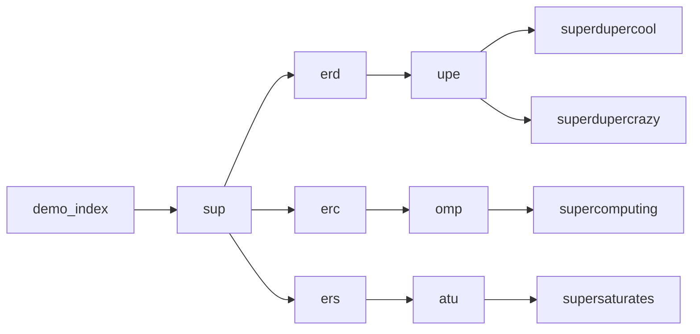

# Prefix Index

A library crate to implement a prefix index in your holochain zomes.

A prefix index is useful for typeahead "search" functionality.

## Usage

Lets say you wanted to make some arbitrary strings searchable.

1. Include the prefix_index crate in your coordinator zome's Cargo.toml:

```toml
[dependencies]
...
prefix_index = { git = "https://github.com/mattyg/holochain-prefix-index" module = "prefix_index" }
```

2. Setup a prefix index

```rust
use prefix_index::PrefixIndex;

let index = PrefixIndex::new("demo_index".into(), LinkTypes::PrefixIndex, 3, 3)?;
```

3. Add some results to the index:
```rust
index.add_result("superdupercool");
index.add_result("superdupercrazy");
index.add_result("supercomputing");
index.add_result("supersaturates");
```

4. This will generate an index of links for the strings as follows:



5. Now you can search the index.
```rust
index.get_results("sup", 10);
// [
//   "supercomputing",
//   "superdupercool",
//   "superdupercrazy",
//   "supersaturates",
// ]

let res2 = index.get_results("superduper", 10);
// [
//   "supercomputing",
//   "superdupercool",
//   "superdupercrazy",
//   "supersaturates",
// ]

let res2 = index.get_results("superduper", 2);
// [
//   "superdupercool",
//   "superdupercrazy",
// ]

let res2 = index.get_results("walrus", 10);
// [ ]
```

*Note that all strings beneath the top-level prefix of your search query will be returned (ordered by similarity, then alphabetically). Make sure to specify a "limit" to reduce the number of returned results.*

## Todo
- [ ] Custom Elements for typeahead search using prefix index 

## Environment Setup

> PREREQUISITE: set up the [holochain development environment](https://developer.holochain.org/docs/install/).

Enter the nix shell by running this in the root folder of the repository: 

```bash
nix-shell
npm install
```

**Run all the other instructions in this README from inside this nix-shell, otherwise they won't work**.


This will create a network of 2 nodes connected to each other and their respective UIs.
It will also bring up the Holochain Playground for advanced introspection of the conductors.

## Running the backend tests

```bash
npm test
```
